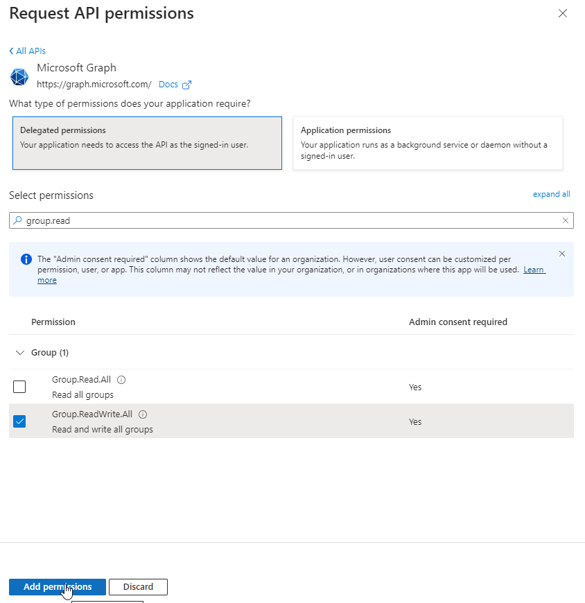

# API Permissions and you

> [Back to Overview](overview.md)

|[Previous: Application vs. Delegate Authentication](application-vs-delegate.md)|[Next: Managing an Application & Troubleshooting logins](managing-applications.md)|

So, understanding the difference between Application and Delegate authentication, you now want to get yourself some juicy permissions, right?

For that we first need to navigate to the "API permissions" section in our Application's page:

As we can see, this new application only has a single permission granted by default - "User.Read", the Delegate right for a user to retrieve information about themselves.

> Note on terminology: The individual API permissions are frequently called "Scopes".

To request more permissions, we need to first select the "Add a permission" button above the table.
This opens a new panel, where we first need to select, from _which_ service we want permissions:

If your service is listed here:
Great.
We will cover how to find unlisted services later.

Let us assume that for the purpose of our project we need the Microsoft Graph service, as we later want to modify the groups we have access to:

Again we are faced with the choice between Delegated and Application permissions.
As we are going for an interactive tool, we pick the Delegated permissions:

We can now search all the permissions the service - in this case Microsoft Graph - offers in Delegated mode.
Using the search panel we can make it easier to find what is needed, then select the permissions' checkboxes and select "Add permissions":

With that selected, we return to the main table of "API permissions":

As we can see, the new permission is listed, but there is a new warning:
ReadWrite for all groups appear a bit permissive and we now need the consent from a Global Administrator for the permission to apply.

Fortunately, in my test tenant that is not a problem - the user already is Global Administrator.
If you are not GA - most organizations try to minimize the number of accounts with that right - you will now have to ask one of them to perform the next steps.

Either way, with the "Grant admin consent for %tenantname%" a GA can now grant the consent and make the permissions apply:

And with that, the consent has now been granted:

## Service Not Found

So far, so good.
Some of the well-known APIs / Services are easy to find when trying to add API permissions.
But ... what if our service is not?
Whether it is some Defender API or maybe our own function app, not all services will be found on the main grid panel of services.

Still, it can be found:

The tab "APIs my organization uses" hides all the remaining services in a tenant:

Using the search box, we can now search for any service in our tenant.
Note, the search is not always convenient and a name that should match does not return anything.

+ If you have the Application ID of the service, searching by that will always be precise.
+ If you have some online guide with screenshots, the header above the individual permissions (in our last screenshot: "Microsoft Graph (2)") shows the name to search for.

|[Previous: Application vs. Delegate Authentication](application-vs-delegate.md)|[Next: Managing an Application & Troubleshooting logins](managing-applications.md)|
