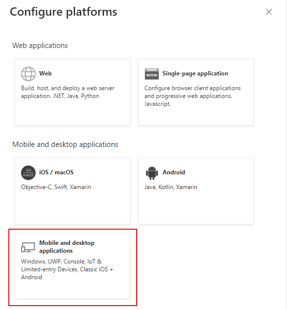
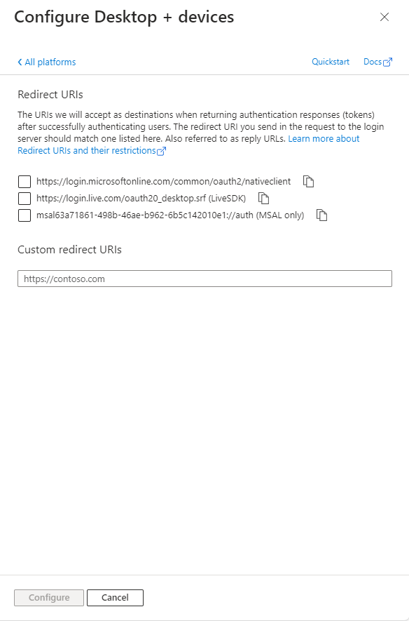
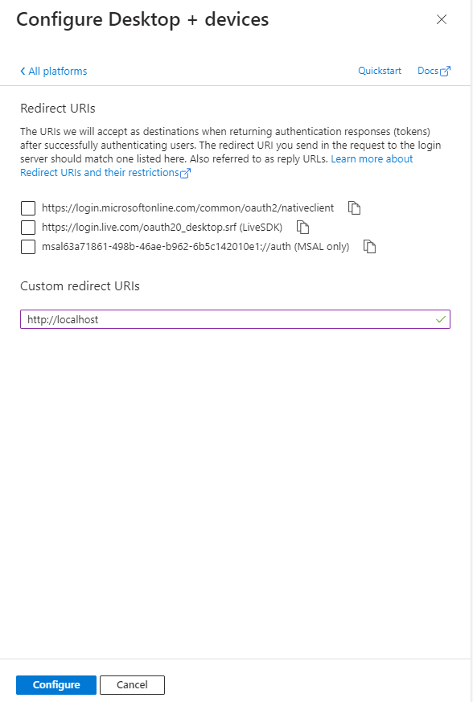
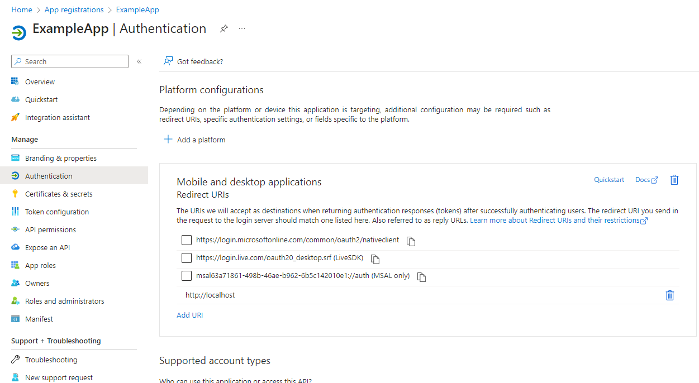

# Delegated: Using the Browser directly

> [Back to Overview](overview.md)

## Configure

Setting up the default login via Browser is fortunately not too complex:
In our App Registration configuration page, we select the "Authentication" tab:


Select "Add a platform" from this page.



Choose "Mobile and desktop applications".
In the follow up menu we can now configure what adjustments we need to add:



All we need to do now, is to add "http://localhost" and select "configure":



And with that we are done!



## Authentication & Executing Queries

Using the EntraAuth PowerShell module, we can now connect using our Application, authenticating in our Browser window:

```powershell
$clientID = '63a71861-498b-46ae-0000-6b5c142010e1'
$tenantID = 'a948c2b3-8eb2-498a-0000-c32aeeaa0f90'

Connect-EntraService -ClientID $clientID -TenantID $tenantID
```

Once connected, we are now ready to use the connection to query all groups in our tenant:

```powershell
Invoke-EntraRequest -Path groups
```

> This example assumes, that we followed the guide on setting up App Registrations and granted the `Group.ReadWrite.All` API permission for Microsoft Graph
