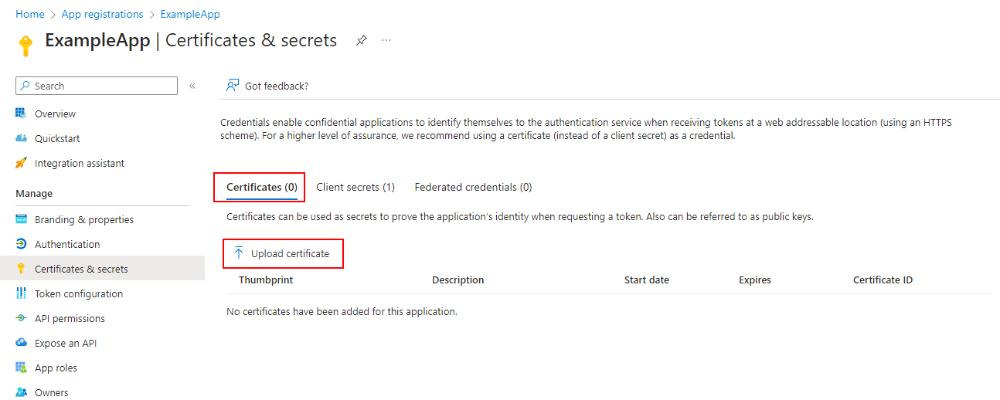

# Application: Certificate

> [Back to Overview](overview.md)

## Configure

The Certificate-based authentication flow requires ... well, a certificate!
The important part here:
Whether it is a certificate from a trusted root CA or not, matters not at all.
Authentication will work either way, self-signed or formal certificate, so pick your poison.

That said, for this demo we will use a self-signed certificate, as that is quite easy to do and globally applicable.
To generate a certificate, all we need is a PowerShell console:

```powershell
$cert = New-SelfSignedCertificate -Subject 'CN=EntraAuth demo certificate' -CertStoreLocation 'Cert:\CurrentUser\My'
```

To store the certificate in the computer certificate store, rather than the user certificate store, replace `'Cert:\CurrentUser\My'` with `'Cert:\LocalMachine\My'` and execute this in an elevated ("Run as administrator") console.

> This sample assumes you are using a Windows operating system.
> How to obtain, store and retrieve a certificate in another OS is beyond the scope of this guide, but otherwise works just the same, once we have the certificate object.

Now, in order for our Application to use this certificate for authentication, we must somehow make this certificate available to it.
The easiest way to do so, now that we have the `$cert` variable is to export the public certificate into a file and upload it via the portal:

```powershell
$bytes = $cert.GetRawCertData()
[System.IO.File]::WriteAllBytes("C:\temp\cert.cer", $bytes)
```

Now to the portal:



Go the to "Certificates & Secrets" section of the App Registration menu, select the "Certificates" tab and then the button "Upload Certificate".
This leads us to the menu to upload our new certificate:


Select the blue button beside the "Select File" panel and pick the certificate file we just wrote to file in the file picker that opens.


And that's it, we are now ready to authenticate:


## Authentication & Executing Queries

> This example assumes that you have granted the "Group.Read.All" Graph API permission to the application.
> The example on configuring API Permissions in this guide uses Delegated permissions instead, _which do not apply to Application Authentication flows!_

Using the EntraAuth PowerShell module, we can now connect using our Application, authenticating with our certificate.

```powershell
$clientID = '63a71861-498b-46ae-0000-6b5c142010e1'
$tenantID = 'a948c2b3-8eb2-498a-0000-c32aeeaa0f90'

# Connect using the certificate object we still have in our variable
Connect-EntraService -ClientID $clientID -TenantID $tenantID -Certificate $cert

# Connect via Certificate thumbprint, cert selected from cert store
Connect-EntraService -ClientID $clientID -TenantID $tenantID -CertificateThumbprint 690667761F6E285B2A6AEFF098B886263433FB54

# Connect via Certificate Subject, cert selected from cert store
Connect-EntraService -ClientID $clientID -TenantID $tenantID -CertificateName 'CN=EntraAuth demo certificate'
```

Once connected, we are now ready to use the connection to query all groups in our tenant:

```powershell
Invoke-EntraRequest -Path groups
```

> Certificates & Service Accounts

One of the common problems when providing a certificate for a script running under a service account is, that the service account obviously has no access to our user's certificate store.
So, to simplify this, we store it in the LocalMachine store, which the Service Account can access ... apparently.

Still authentication keeps failing.

This is usually caused by the service account not having access to the private key of the certificate.
As a local admin, you can modify who can access the private key in an elevated certificate console.
