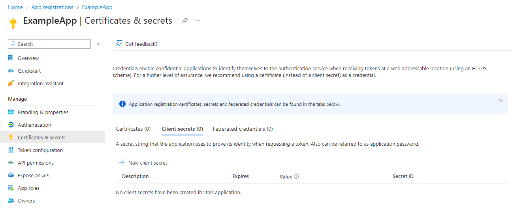
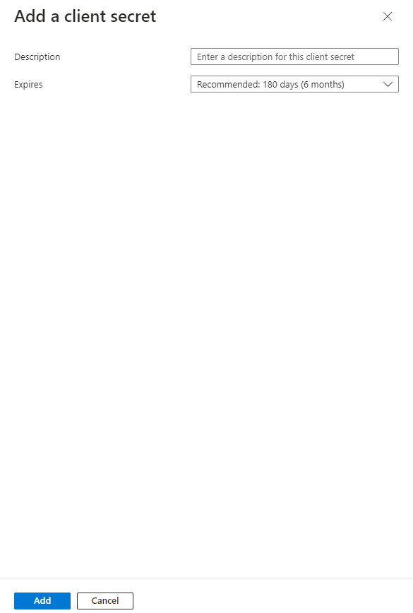
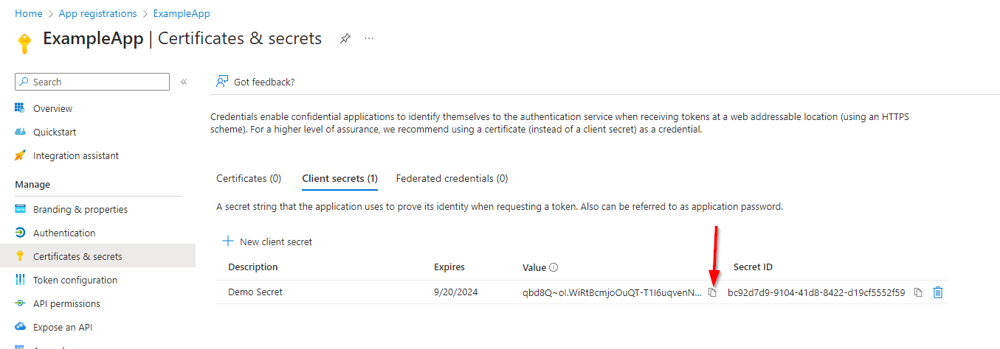

# Application: Client Secret

> [Back to Overview](overview.md)

## Configure

To configure the Client Secret authentication, not much is needed.
In the "Certificates & secrets" section of the App Registration, we already start on the Client secrets section by default.



Select "New client secret":



Adding a description is optional but recommended.
The expiration option defines, how long a secret will remain valid, with a limit of two years.
Configure as needed and select "Add".



We can now see the secret in the table.
In the "Value" column we can now access the secret value (use the "Copy to Clipboard" button).

> This is THE ONLY TIME we can access the secret.
> If we do not copy it now and store it somewhere else (such as a password safe), it is gone and we can start again!

That's it, we are now ready to roll.

## Authentication & Executing Queries

> This example assumes that you have granted the "Group.Read.All" Graph API permission to the application.
> The example on configuring API Permissions in this guide uses Delegated permissions instead, _which do not apply to Application Authentication flows!_

Using the EntraAuth PowerShell module, we can now connect using our Application, authenticating with our client secret.
This example assumes the secret value is in our clipboard.

```powershell
$clientID = '63a71861-498b-46ae-0000-6b5c142010e1'
$tenantID = 'a948c2b3-8eb2-498a-0000-c32aeeaa0f90'
$secret = Get-ClipBoard | ConvertTo-SecureString -AsPlainText -Force

Connect-EntraService -ClientID $clientID -TenantID $tenantID -ClientSecret $secret
```

Once connected, we are now ready to use the connection to query all groups in our tenant:

```powershell
Invoke-EntraRequest -Path groups
```
