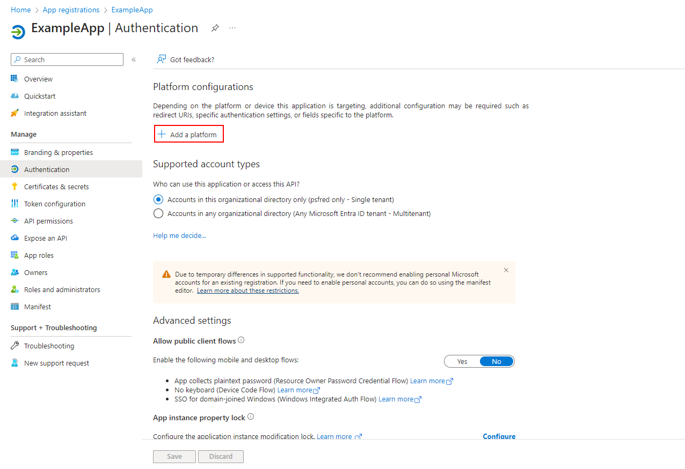
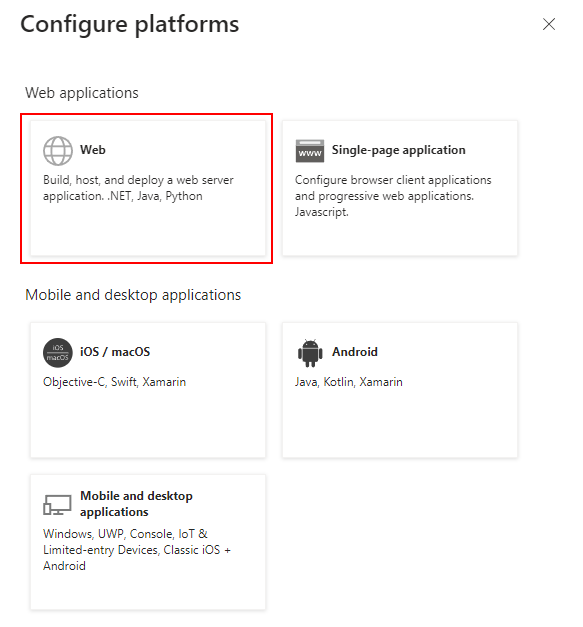
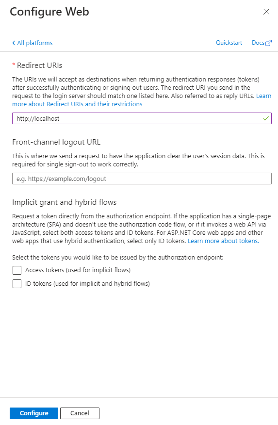
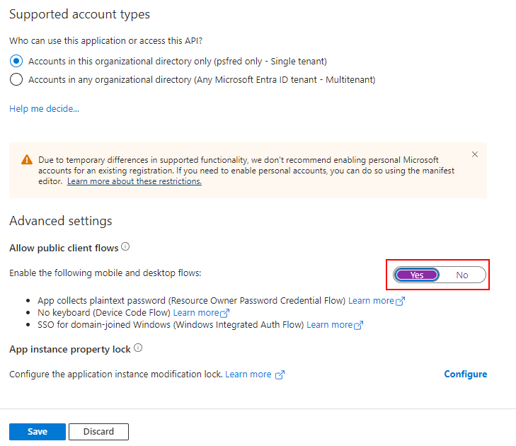

# Delegated: DeviceCode

> [Back to Overview](overview.md)

> Note: It is generally recommended to use [Interactive Browser Authentication / Authorization Code](authenticate-browser.md)

## Configure

Setting up the default login via DeviceCode is fortunately not too complex:
In our App Registration configuration page, we select the "Authentication" tab:



Select "Add a platform" from this page.



Choose "Web".
In the follow up menu we now need to configure a Redirect Uri:



All we need to do now, is to add "http://localhost" and select "configure".

After adding the platform, we need to scroll to the bottom and enable "Allow public client flows":



Once enabled and saved, we are good to go.

## Authentication & Executing Queries

Using the EntraAuth PowerShell module, we can now connect using our Application, authenticating in our Browser window:

```powershell
$clientID = '63a71861-498b-46ae-0000-6b5c142010e1'
$tenantID = 'a948c2b3-8eb2-498a-0000-c32aeeaa0f90'

Connect-EntraService -ClientID $clientID -TenantID $tenantID -DeviceCode
```

```text
To sign in, use a web browser to open the page https://microsoft.com/devicelogin and enter the code CCXBG2F8C to authenticate.
```

Follow the guidance in the response and finish authentication.
Once connected, we are now ready to use the connection to query all groups in our tenant:

```powershell
Invoke-EntraRequest -Path groups
```

> This example assumes, that we followed the guide on setting up App Registrations and granted the `Group.ReadWrite.All` API permission for Microsoft Graph
