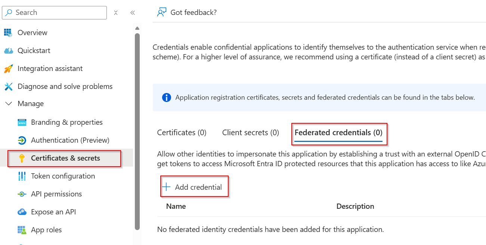
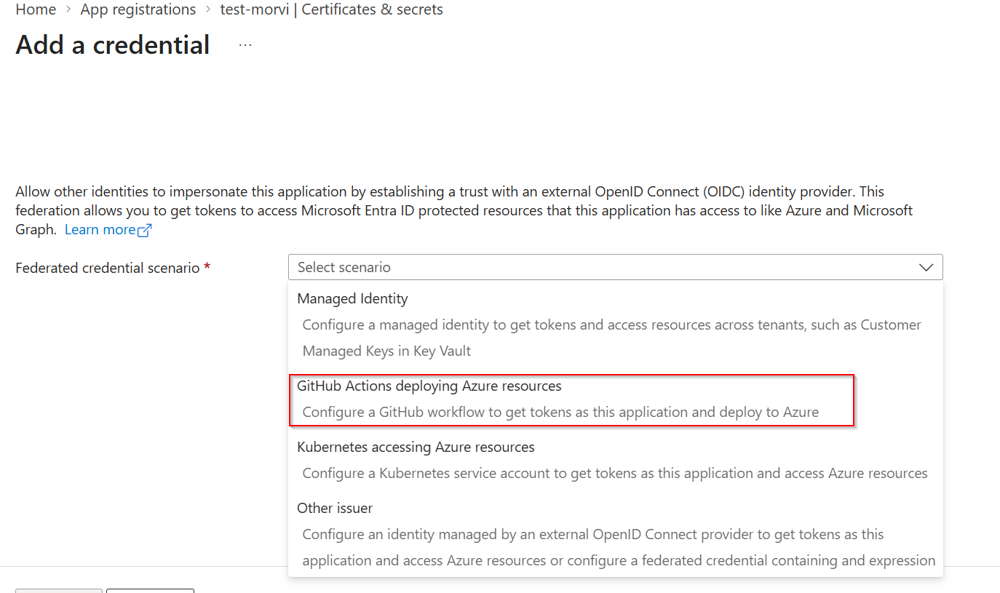
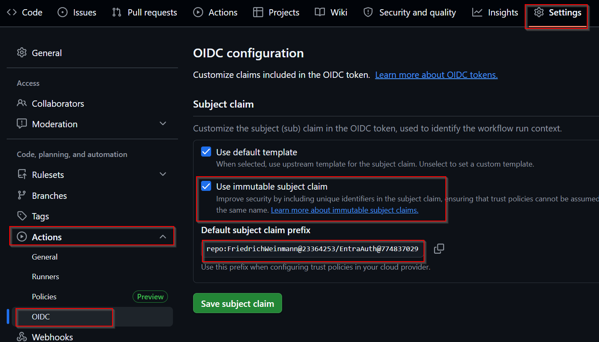
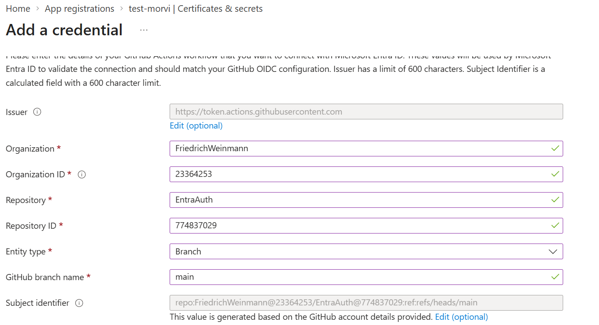

# Authentication with Federated Credentials - EntraAuth + GitHub Actions

> [Back to Overview](overview.md)

## Configure

With federated credentials, GitHub Actions issues a short-lived OIDC token for the workflow run. Entra ID trusts that token (because you've configured a federated credential that matches the claims in it) and exchanges it for an Entra access token meaning no secrets stored in GitHub at all.

## Step 1: Create the application

1. In the Entra admin center, go to **App registrations** and create a new app (e.g. `test-FederatedCredentials`).
2. Note the **Application (client) ID** and **Directory (tenant) ID** - you'll need both later.
3. Grant the app whatever API permissions it needs (e.g. Microsoft Graph scopes) as you normally would for any app registration.

## Step 2: Create the GitHub repository

Create (or use an existing) GitHub repository that will host the Actions workflow requesting the token. For federation to work, the identifiers of this repo (and its owning org/user account) need to match exactly what you configure on the Entra side in Step 3.

## Step 3: Set up the federated credential

In the app registration, go to **Certificates & secrets -> Federated credentials -> Add credential**, then choose the scenario **"GitHub Actions deploying Azure resources."**




You'll need four pieces of GitHub metadata: **Organization**, **Organization ID**, **Repository**, and **Repository ID**. The names are self-explanatory, but the *IDs* are numeric GitHub IDs, not the display names - you look them up via the GitHub REST API:

| Field | How to find it | Example URL |
|---|---|---|
| Organization ID | `GET https://api.github.com/users/<Your_GitHub_UserName_or_Org>` - look for the `id` field in the response | `https://api.github.com/users/FriedrichWeinmann` |
| Repository ID | `GET https://api.github.com/repos/<Repository_Owner>/<Repository>` - look for the `id` field in the response | `https://api.github.com/repos/FriedrichWeinmann/EntraAuth` |

You can open these URLs directly in a browser (no auth needed for public accounts/repos) and read the `id` value out of the JSON.

### Example values used in this walkthrough

```text
Organisation:      FriedrichWeinmann
Organization ID:   23364253
Repository:        EntraAuth
Repository ID:     774837029
Entity type:       Branch
GitHub branch name: main
```

Filling out the **Add a credential** form in Entra with these values gives you a computed **Subject identifier**, generated automatically from the values you enter:

```text
repo:FriedrichWeinmann@23364253/EntraAuth@774837029:ref:refs/heads/main
```

>**NOTE**: You can also check and verify it by being on the repository going to Settings -> Actions -> OIDC (Validate that 'Use immutable subject claim' is enabled it is by default on new repository but might not be on an older repository)



> This "id-qualified" subject format (`org@orgId/repo@repoId`) is Entra's newer, more secure subject claim format. It ties the trust to GitHub's immutable numeric IDs instead of just the org/repo *names* - which matters if a repository or account is ever renamed or transferred, since names can be reused by someone else but IDs cannot.

### Required: enable "Use immutable subject claim" on GitHub

For the ID-qualified subject above to actually match the `sub` claim GitHub puts in its OIDC token, you must turn on a matching setting **on the GitHub side**:

1. In your repository, go to **Settings -> Actions -> OIDC**.
2. Under **Subject claim**, tick **"Use immutable subject claim."**
3. Click **Save subject claim.**

This tells GitHub to issue OIDC tokens using the `repo:<org>@<orgId>/<repo>@<repoId>:ref:refs/heads/<branch>` subject format - matching what Entra computed above. Without this setting, GitHub's default subject claim uses just the org/repo *names* (`repo:Org/Repo:ref:refs/heads/main`), which won't match the ID-based subject identifier Entra generated, and token exchange will fail.

**Bonus / fallback:** If you can't enable "Use immutable subject claim" (e.g. restricted by org policy), click **Edit (optional)** next to the Subject identifier field in Entra and manually set it to the name-based format instead:

```text
repo:FriedrichWeinmann/EntraAuth:ref:refs/heads/main
```

This matches GitHub's default (non-immutable) subject claim, so you don't need to change anything on the GitHub side - trading a little future-proofing (protection against name reuse) for simplicity.

### Finish creating the credential

Give the credential a name/description and save it. You should now see it listed under **Federated credentials** in the app registration.



### Example workflow

```yaml
name: test

on:
  workflow_dispatch:

jobs:
  get-token:
    runs-on: windows-latest
    permissions:
      id-token: write # Required to fetch an OIDC token.
    steps:
      - name: Get an Entra token via the federated credential
        shell: pwsh
        run: |
          Install-Module EntraAuth -Scope CurrentUser -Force

          $clientID = '63a71861-498b-46ae-0000-6b5c142010e1'
          $tenantID = 'a948c2b3-8eb2-498a-0000-c32aeeaa0f90'

          Connect-EntraService -ClientID $clientID -TenantID $tenantID -Federated

          Get-EntraToken | Select-Object -ExcludeProperty TokenData, AccessToken, ClientID, TenantID, Issuer
```

Key points about this workflow:

- **`permissions: id-token: write`** is mandatory - without it GitHub won't issue an OIDC token to the job at all.
- The workflow runs only on `workflow_dispatch` here for manual testing.
- `Get-EntraToken | Select-Object -ExcludeProperty ...` is just there to print a sanity-check result without leaking the token or client details in the run log.

Trigger the workflow manually (**Actions -> test -> Run workflow**) and confirm it completes without an auth error -> that confirms the federated trust between GitHub and Entra ID is working end to end.
