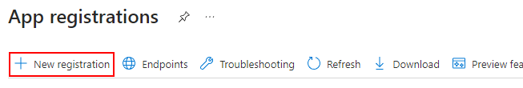

# Creating an Application

> [Back to Overview](overview.md)

|[Back to Overview](overview.md)|[Next: Application vs. Delegate Authentication](application-vs-delegate.md)|

## What the hell?

At a fundamental level, an Application - or "App Registration" as it is frequently called - is a construct in Entra that describes how you connect.
On an application, you configure ...

+ ... just how you can connect
+ ... who is allowed to connect
+ ... what rights you want to use after connecting

It also allows you to troubleshoot connection issues.

> Note: This is an oversimplification, but good enough for the purpose of this guide.

## Get Creating

In the [Azure Portal](https://portal.azure.com) we first must select the "App registrations" option:

If it is not on the list of already listed services (which usually shows the last services opened), you can use the search bar at the top to search for it instead.

Once there, we create a new App Registration:

And finally we configure our new application's basic settings:

We need a name for this Application - and this is one of the things this guide can't really help you with:
Many organizations have their own naming schemes, and you either have to figure out your organization's scheme on your own or ask a coworker in the know.

Or you pick something that seems reasonable and live with the consequences - it is usually quite simple to recreate all the things we configure in an App Registration, so it is not like you will have to live for ages with a bad call here.

For supported account types, leave it as it is as "Single tenant" - the other options are usually only relevant to software vendors or developers who are far more experienced than anybody reading this guide likely is and know what they do with that.

Select "Register" once you are happy with your application's name.

And that is it, you just created your first App Registration:

Note the highlighted "Application (client) ID" and "Directory (tenant) ID":
Those will be needed when we try to connect later on.

|[Back to Overview](overview.md)|[Next: Application vs. Delegate Authentication](application-vs-delegate.md)|
