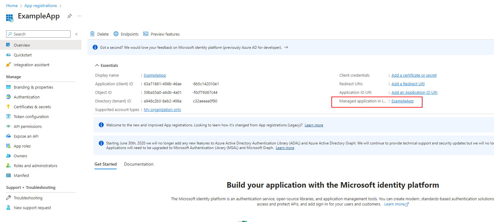
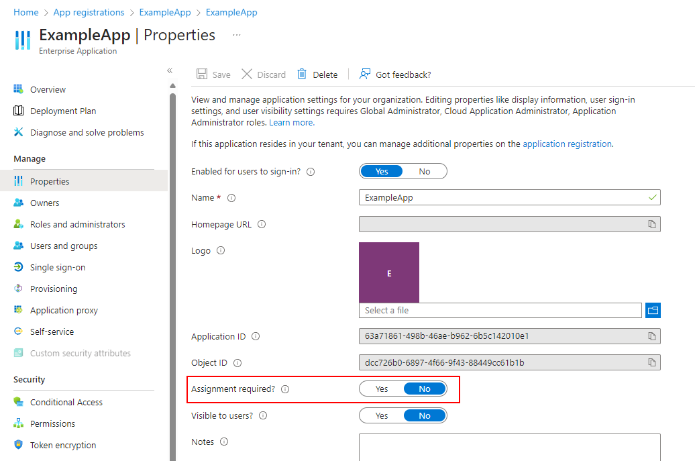
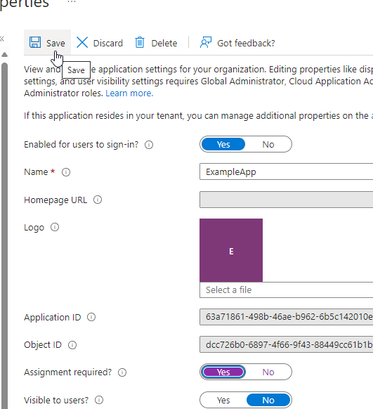
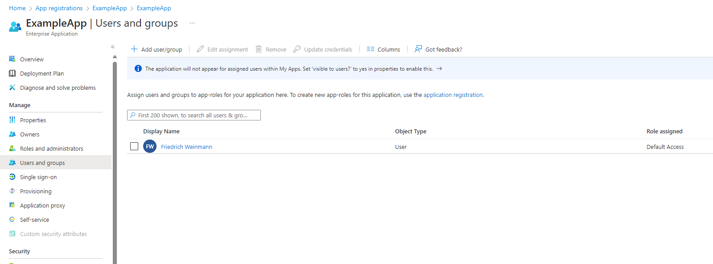
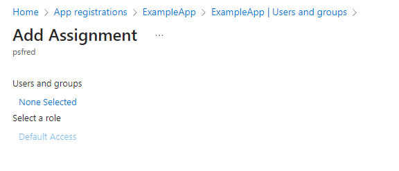
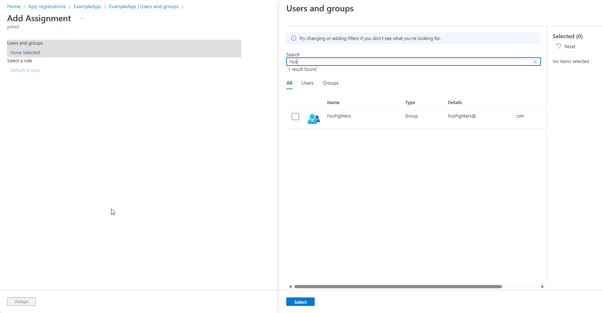
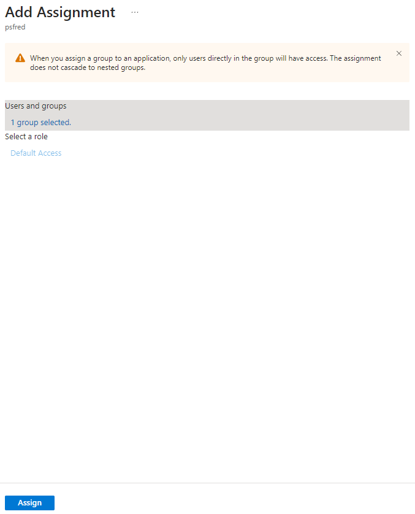
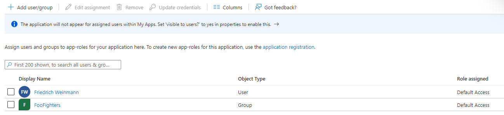
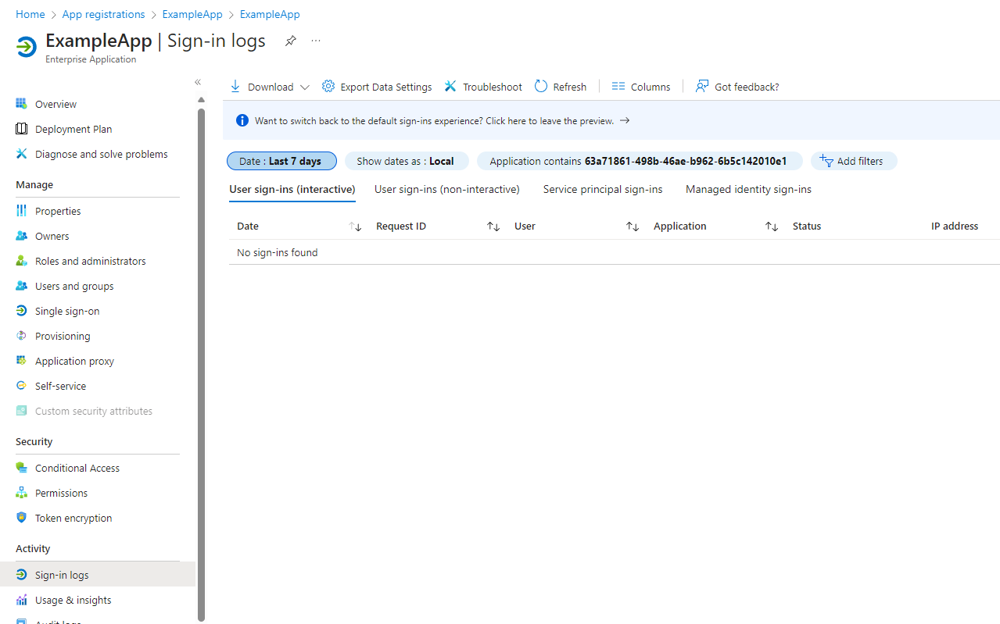

# Managing an Application & Troubleshooting logins

> [Back to Overview](overview.md)

|[Previous: API Permissions and you](api-permissions.md)|[Back to Overview](overview.md)|

Our application is now prepared and ready to rock!
Well ... almost.

We have not yet configured authentication itself.
If we did, then _every_ user in the tenant could use our Application.

This is usually something we want to avoid, so lot us restrict it to members of a specific group!

In the overview section of our App Registration, there is a link to the manageability panel ("Enterprise Application") of our application.
Not going into the details here, but it is where we configure who can use it.

To do so, first select the link behind the "Managed application" section:

Once in the new menu, switch to Properties:

Enable "Assignment required?" and remember to save:

Alright, that done, now nobody (other than yourself) can use the Application.
To add more people to it, switch to "Users and groups":

To add a group, select "Add user/group" at the top, opening the assignment menu:

To add a group, select the "None Selected" link.

> The "Select a role" option is greyed out. More complex applications could define their own permissions, allowing us to assign different permissions to different groups.
> A topic for another day.

The new panel allows us to search for any user or group in the tenant.
Set the checkbox for all entries we want to add and confirm with "Select" at the bottom.

Once done, select "Assign" to complete the assignment:

And that is it!
We have now limited just who is allowed to use our application and the rights associated.

## Troubleshooting SignIns

Not really critical for configuring our Application, if we later want to troubleshoot logon problems or check usage, there is another useful section in this menu:

Sign-in logs:

Nothing to see here yet, but useful if you later fail to login and can't figure out why.

|[Previous: API Permissions and you](api-permissions.md)|[Back to Overview](overview.md)|
